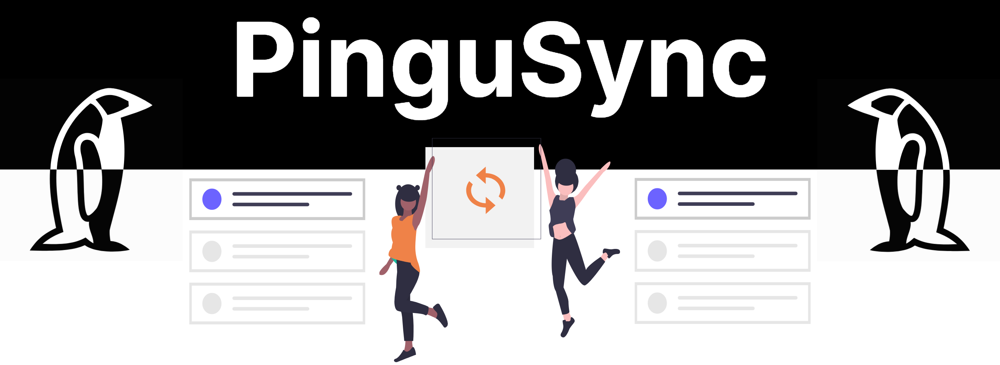

# ! WORK IN PROGRESS (Currently not useable)

 

---

**PinguSync** is an open source software that helps to keep the different lists synchronized between different sites. With focus on anime, series and movies.

**PinguSync** is in the early stages of development and will take years to become usable.

Example: You mark a Series as watched on **AniList** and **PinguSync** will sync that mark to **Kitsu**.
Now you have that series marked as watched on **Kitsu** and **AniList**.

---

## Sites that currently will be Supported

Providers that only have login support will become later the list sync support.

> **For Devolopers:**
> All provider for list syncing need to follow the interface **ListProvider** (list-provider.ts)
> All Provider API's are stored in the folder:

    src/backend/api/information-providers

| Provider | List sync Support | Login Support|
|--|--|--|
|[AniList](https://anilist.co/)| ❌ | ✔️
|[trakt.tv](https://trakt.tv/)| ❌ | ✔️
|[AniDB](http://anidb.net/)| ❌ | ❌
|[Kitsu](https://kitsu.io/)| ❌ | ✔️
|[MyAnimeList](https://myanimelist.net/)| ❌ | ✔️
|[Simkl](https://simkl.com/) (Planned)| ❌ | ❌
|[aniSearch](https://www.anisearch.de/) (Planned)| ❌ | ❌
|[Proxer](https://proxer.me/) (Planned)| ❌ | ❌
|[Anime-Planet](https://Anime-Planet.com) (Planned)| ❌ | ❌

---

## Current Plan

- Basic list sync design
- Better Provider API support
- Watching the next episode directly on Crunchyrole, Netflix, Amazone Prime...
- Sync watch progress automaticly

## Thanks to

[alvorninha](https://github.com/alvorninha) for git page design
